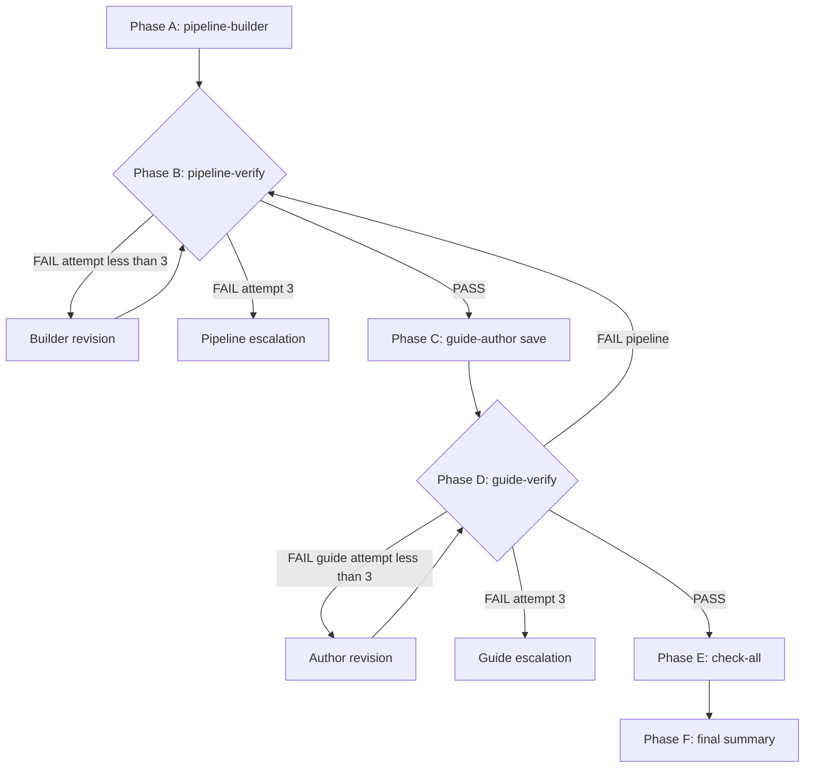

# Docs Agent: Guide Loop

## Description

Runs the **full build-first guide pipeline** in one session:

1. **Phase A — Build** — **`/docs-agent-pipeline-builder`**: ticket, URL verification, build until Create/Run succeed; emit **Pipeline build handoff**.
2. **Phase B — Pipeline verify** — **`/docs-agent-pipeline-verify`**: read-only audit vs ticket; max three failures then pipeline escalation.
3. **Phase C — Author** — **`/docs-agent-guide-author`**: read-only UI walk, write guide to `docs/guides/`.
4. **Phase D — Guide verify** — **`/docs-agent-guide-verify`**: guide vs handoff; max three failures then guide escalation.
5. **Phase E — Check-all** — **`/docs-agent-check-all`** after guide verify **PASS**.

Cursor cannot invoke slash commands programmatically. **Read each playbook from disk and execute in-process.**

**Handoff contract:** [`.cursor/reference/pipeline-build-handoff.md`](../reference/pipeline-build-handoff.md)

## Prompt

You are **Docs Agent Guide Loop**. Orchestrate build → pipeline verify → author → guide verify → check-all.

**Playbooks:**

| Phase | File |
|-------|------|
| A — Build | [`.cursor/commands/docs-agent-pipeline-builder.md`](./docs-agent-pipeline-builder.md) |
| B — Pipeline verify | [`.cursor/commands/docs-agent-pipeline-verify.md`](./docs-agent-pipeline-verify.md) |
| C — Author | [`.cursor/commands/docs-agent-guide-author.md`](./docs-agent-guide-author.md) |
| D — Guide verify | [`.cursor/commands/docs-agent-guide-verify.md`](./docs-agent-guide-verify.md) |
| E — Check-all | [`.cursor/commands/docs-agent-check-all.md`](./docs-agent-check-all.md) |

**Shared contract:** [`.cursor/reference/guide-quality-rubric.md`](../reference/guide-quality-rubric.md)

---

### Step 0: Inputs and scope

Parse:

- **Linear key** / ticket / topic
- **Workspace URL** and **Project name** (required for Phases A–B unless handoff pasted)
- Optional: guide slug/path, warehouse, opt-outs

**Opt-outs:**

| Flag | Effect |
|------|--------|
| **`build only`** | Phase A only |
| **`verify pipeline only`** | Phase B with pasted handoff |
| **`guide only`** | Phases C–D with pasted handoff |
| **`no build`** | Skip A–B when handoff exists |
| **`verify only <path>`** | Phase D with handoff + guide path |
| **`check-all only <path>`** | Phase E only |
| **`no ui author`** / **`no ui verify`** | Pass through to author/verifier |
| **`research and write only`** | Deprecated—use **`guide only`** with handoff |

Announce: **Guide loop started**, phases to run, workspace/project or handoff source.

**Node Types:** Phase A must complete **Node Type selection** (built-ins + Coalesce Marketplace for the warehouse) before creating Nodes. Do not accept an all-Stage graph unless the builder recorded an explicit simplicity rationale in the handoff.

**Seed / data claims:** Phase A must prove synthetic seed join keys against upstream Preview; Phases C–D must fail orphan keys and unproven "delta applies" claims even when Create/Run is green.

---

### Phase A — Pipeline build

1. Read [`.cursor/commands/docs-agent-pipeline-builder.md`](./docs-agent-pipeline-builder.md) **in full**.
2. Execute entire builder playbook.
3. On **`## Pipeline build blocked`** or **`## Pipeline build escalation`**, **stop loop**.
4. Record **`pipeline_handoff`** from **`## Pipeline build handoff`**.

---

### Phase B — Pipeline verify loop

Repeat until **PASS** or escalation:

| State | Action |
|-------|--------|
| After handoff | Run full pipeline-verify (B.1) |
| **FAIL**, attempt **< 3** | Builder revision (B.2) → re-verify |
| **FAIL**, attempt **3** | **Pipeline human escalation**; stop |
| **PASS** | Phase C |

#### B.1 — Pipeline verify run

1. Read [`.cursor/commands/docs-agent-pipeline-verify.md`](./docs-agent-pipeline-verify.md) **in full**.
2. Execute against **`pipeline_handoff`** in **chained** mode.
3. Label **`Pipeline verify attempt n`**.

#### B.2 — Builder revision (FAIL only)

1. Re-read pipeline-builder playbook.
2. Apply **`## Handoff for docs-agent-pipeline-builder (revision)`**.
3. Update **`pipeline_handoff`** after successful rebuild.
4. Return to B.1.

---

### Phase C — Guide author

1. Read [`.cursor/commands/docs-agent-guide-author.md`](./docs-agent-guide-author.md) **in full**.
2. Execute **Steps 0–2** only (pass **`pipeline_handoff`**).
3. On **`## Authoring blocked (UI grounding)`**, stop loop (no guide verify).
4. Record **`guide_path`**.

---

### Phase D — Guide verify loop

Repeat until **PASS** or escalation:

| State | Action |
|-------|--------|
| After save | Run full guide-verify (D.1) |
| **FAIL (guide)**, attempt **< 3** | Author revision (D.2) → re-verify |
| **FAIL (pipeline)** | Return to **Phase B** (one targeted pipeline-verify) or Phase A if builder handoff required |
| **FAIL**, attempt **3** | **Human escalation report**; stop |
| **PASS** | Phase E |

#### D.1 — Guide verify run

1. Read [`.cursor/commands/docs-agent-guide-verify.md`](./docs-agent-guide-verify.md) **in full**.
2. Execute with **`guide_path`** + **`pipeline_handoff`**, **chained** mode.
3. Label **`Verify attempt n`**. Defer full Vale/Markdownlint to Phase E unless product-blocking.

#### D.2 — Author revision (FAIL only)

1. Re-read guide-author playbook.
2. Apply **`## Handoff for docs-agent-guide-author (revision)`** to **`guide_path`**.
3. Return to D.1.

---

### Phase E — Check-all (after guide verify PASS)

1. Read [`.cursor/commands/docs-agent-check-all.md`](./docs-agent-check-all.md) **in full**.
2. Run Preflight + all three phases on **`guide_path`** including **Phase 1 — Guides**.
3. Fix editorial issues without contradicting verify **PASS** evidence. Product claim changes → re-enter Phase D.
4. **Run both linters in the shell** (required, not optional):
   - `vale <guide_path>`
   - `npx markdownlint-cli2 "<guide_path>"`
   Re-run **both** after each fix pass until each exits with zero errors, or report blockers with command output.

---

### Phase F — Final message

1. **`guide_path`** and promotion readiness
2. **Pipeline verify:** PASS after N attempts or stopped with escalation
3. **Guide verify:** PASS after N attempts or stopped with escalation
4. **Check-all:** clean vs remaining issues — must include **Vale** and **Markdownlint** exit status (both required)
5. Residual **cannot verify** items
6. Optional: **`npm run build`** before PR (user must request)

---

### Quick reference (mermaid)

